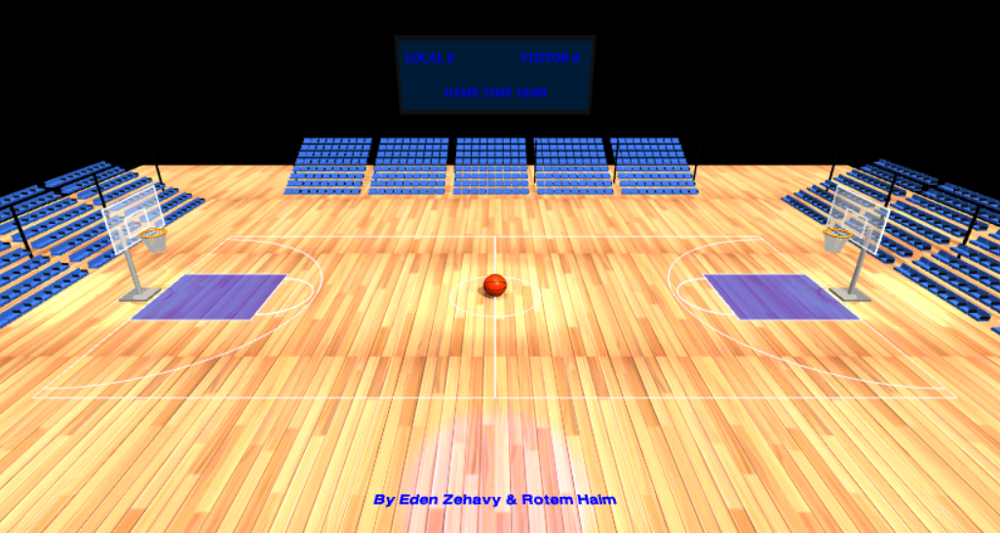
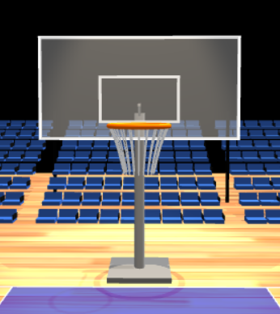
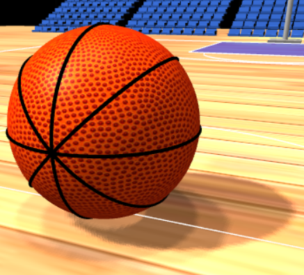
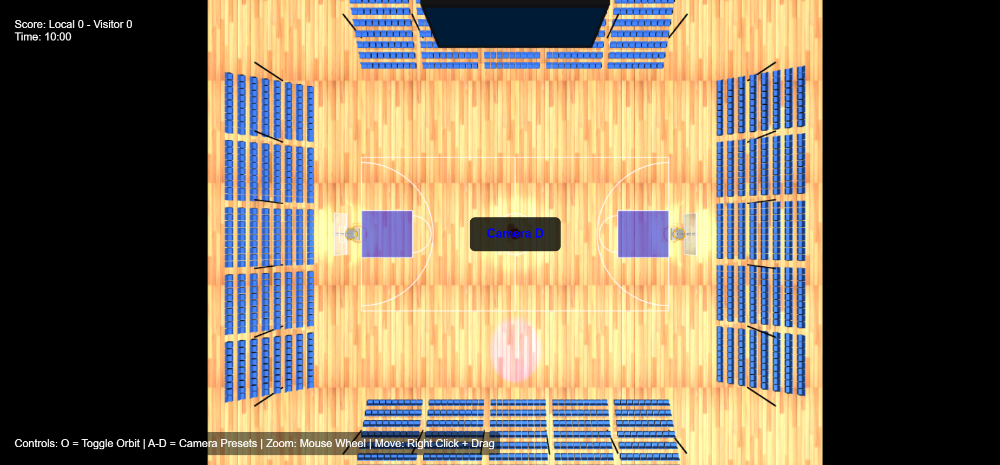

# Basketball Court 3D – THREE.js

## Group Members
- Eden Zehavy 314832270
- Rotem Haim 314652496

## Overview
This project is an interactive 3D basketball court built with [THREE.js](https://threejs.org/). It features a detailed court, hoops, bleachers, lighting, and interactive camera controls. The scene is fully responsive and visually realistic, with shadows, textures, and user-friendly controls.

## How to Run
1. **Install dependencies** (if any):
   - This project uses only client-side JS and THREE.js (included via import/module).
2. **Start the application:**
   ```bash
   node index.js
   ```
   The server will run on port 8000 by default.
3. **Open your browser:**
   - Go to [http://localhost:8000](http://localhost:8000)

## Features & Requirements Checklist
### Mandatory Infrastructure (HW05)
- [x] Properly sized basketball court (rectangular, ~2:1 ratio, wood color)
- [x] Court markings: center circle, three-point lines (curved), center line, clear white lines
- [x] Two basketball hoops:
  - [x] Backboard (white, partially transparent)
  - [x] Orange rim at regulation height
  - [x] Net with line segments (at least 8)
  - [x] Support structure (pole and arms) behind backboard
  - [x] Hoops face center court
- [x] Static basketball:
  - [x] Orange with black seams
  - [x] Proper size, geometry, and material
  - [x] Positioned at center court
- [x] Camera and lighting:
  - [x] Appropriate lighting with shadows
  - [x] Interactive orbit camera controls (toggle with 'O')
  - [x] Preset camera positions (A, B, C, D)
  - [x] Responsive to window resizing
- [x] UI framework:
  - [x] HTML containers for future score and controls display
  - [x] Basic CSS styling for UI elements
  - [x] UI elements positioned appropriately
- [x] Code style: ES modules, camelCase, comments, organized structure

### Bonus Features (Optional, implemented)
- [x] Stadium environment (bleachers on all sides)
- [x] Scoreboard with static timer - will be non-static in HW6
- [x] Enhanced lighting (multiple spotlights, stadium light)
- [x] Multiple camera preset positions with popup indicator
- [x] Textured surfaces for court and basketball

### Not Included (for HW06)
- Interactive basketball controls (Arrow Keys, W/S, Spacebar, R)
- Physics-based movement, shooting, scoring

## Controls
- **O**: Toggle orbit camera controls ("Camera Locked" message appears when locked)
- **A**: Initial view (in front of the signature)
- **B**: Behind the right hoop
- **C**: Behind the left hoop
- **D**: Top-down (bird's eye) view
- After pressing A/B/C/D, a popup will indicate the camera mode

## Project Structure
- `index.js` – Entry point/server
- `index.html` – Main HTML file
- `src/hw5.js` – Main scene and logic (all 3D, controls, and rendering)
- `src/OrbitControls.js` – Camera orbit controls
- `src/textures/` – Textures for court and basketball
- `CONFIGURATION.md` – Project and code style guidelines

## Sources of External Assets
- [THREE.js](https://threejs.org/) (core library)
- [Basketball texture](src/textures/basketball.png)
- [Wood floor texture](src/textures/wood_floor.jpg)
- Fonts loaded from [threejs.org](https://threejs.org/examples/fonts/)

## Screenshots (MANDATORY)

### Overall view of the basketball court with hoops


### Close-up view of basketball hoops with nets


### Basketball positioned at center court


### Camera controls functionality


## Submission Notes
- Submit via a public GitHub repository (recommended) or as a zip file
- Include all source code, textures, and screenshots
- Ensure this README is up to date and complete

## References
- [THREE.js Documentation](https://threejs.org/docs/)
- [Three.js Examples](https://threejs.org/examples/)
- [Discover Three.js](https://discoverthreejs.com/)
- Standard basketball court: 28m x 15m (92ft x 50ft)
- Standard rim height: 3.05m (10ft)

---

**Authors:** Eden Zehavy & Rotem Haim 