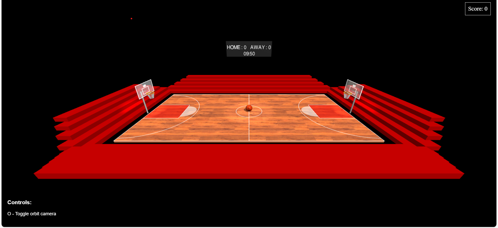
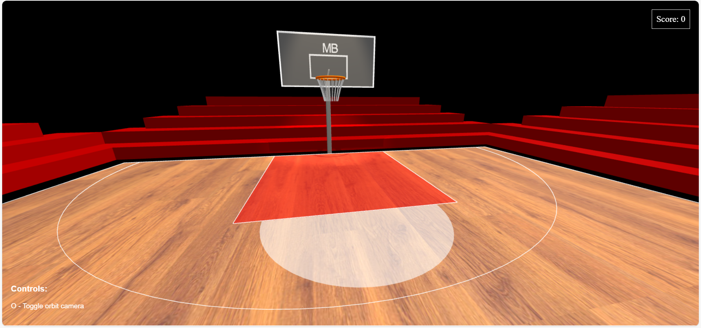
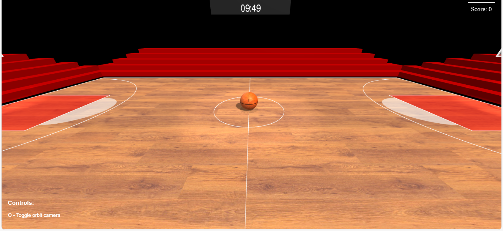
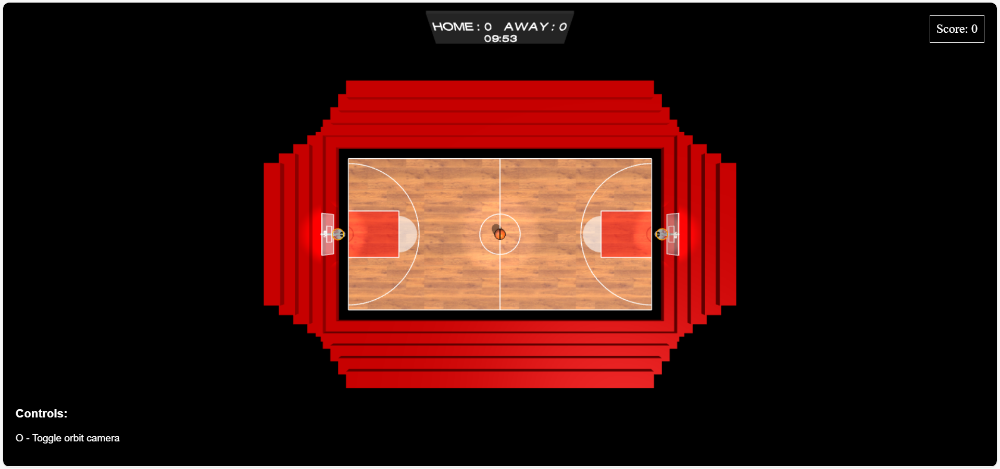
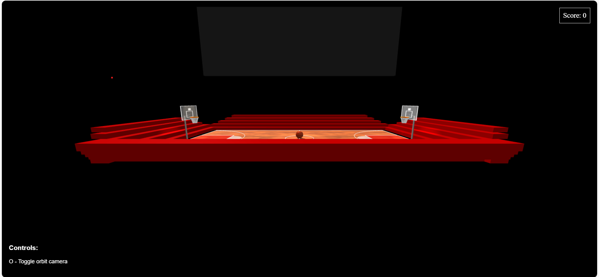
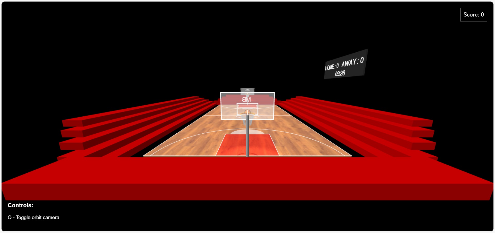

# HW05 – Interactive Basketball Court with WebGL and Three.js

**Semester:** Spring 2025  
**Course:** Computer Graphics  
**Student Name :** May Bourshan

---

## 🏀 Overview

This project implements a fully interactive 3D basketball court scene using WebGL and Three.js, meeting all mandatory requirements of HW05 and going far beyond with rich bonus features.

---

## ✅ How to Run

1. Clone or download the project files  
2. Open `index.html` in a modern browser  
   *(If fonts or textures are local, run with a local server like `Live Server` in VSCode)*
3. Use these controls:
   - `O` – Toggle orbit camera
   - `1` – Top-down view
   - `2` – Behind scoreboard view
   - `3` – Classic angled view
   - `4` – Sideline view

---

## 🎯 Mandatory Features Implemented

- ✅ Full-size court with:
  - Center circle
  - Center line
  - Three-point arcs (both sides)
  - Court boundaries
- ✅ Two basketball hoops with:
  - Transparent backboards
  - Orange rims
  - Metal chain nets (20 segments)
  - Back support poles and angled arms
- ✅ Realistic basketball at center court:
  - Orange texture with leather-like appearance
  - 4 seam lines: 2 horizontal, 2 vertical (using TubeGeometry)
  - Correct size and geometry (radius: 0.5)
  - Two logos (Nike and NBA) added directly on the ball surface
- ✅ Camera setup:
  - Orbit controls toggleable with `O`
  - Default and multiple preset views
- ✅ UI framework:
  - Score display (`HOME : 0   AWAY : 0`)
  - Live countdown timer (10:00 → 0:00)
  - On-screen controls instructions
  - Styled HTML elements with CSS

---

## 🌟 Bonus Features (Full 10 Points Achieved)

### 🏀 Detailed Court Markings
- Painted key area ("The Paint") in red with white outline
- Free-throw arcs using curved lines
- Full court border, center line, 3-point arcs

### 🧱 Realistic Textures
- Wooden floor texture on the court
- Basketball texture with leather-like surface

### 💡 Advanced Lighting
- Ambient + directional light
- Hemisphere light for sky-ground blend
- Three spotlights:
  - 2 on each hoop
  - 1 from above center court
- All lights support shadows

### 🏗️ Detailed Hoop Design
- Backboards with white border outlines
- Orange torus rims
- Metal chain nets with smooth curve simulation
- Support pole + diagonal arm
- Logos ("MB") on each backboard – one mirrored

### 🏟️ Stadium Environment
- Full bleachers (stadium seating) on all sides
- Large scoreboard with:
  - Static score text
  - Dynamic countdown timer (`TextGeometry`)
- External score UI (`div#score`) in top corner
- HTML UI for user instructions

### 🎥 Multiple Camera Presets
- 4 view presets available with keys `1` to `4`

## 📸 Screenshots

### 🏀 Full court view  
(*This is the default camera preset when pressing `3`*)  

### 🔍 Close-up of basketball hoop with net  

### 🎯 Basketball positioned at center court  

### 🎥 Camera controls in action  
The following views demonstrate the working camera presets triggered by keys `1`, `2`, and `4`:

- **Top-down view (key `1`)**  
  

- **Behind scoreboard view (key `2`)**  
  

- **Sideline view (key `4`)**  
  

---

## ⚠️ Known Issues

- No known issues. Fully tested on Chrome and Edge.

---

## 🔗 External Assets Used

- `wood_floor.jpg` — wooden floor texture
- `basketball.jpg` — ball texture
- [Three.js Helvetiker font](https://threejs.org/examples/fonts/helvetiker_regular.typeface.json)

---

## 📝 Notes

All components were implemented from scratch with custom geometry and logic, including the scoreboard timer, net curves, and dynamic text updates.

