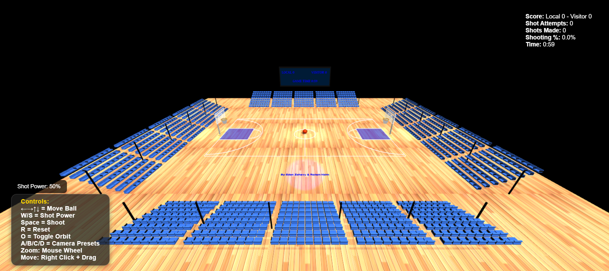

# Interactive Basketball Shooting Game with Physics – THREE.js (HW06)

## Group Members

- Eden Zehavy 314832270
- Rotem Haim 314652496

## How to Run

1. **Install dependencies** (if any):
   - This project uses only client-side JS and THREE.js (included via import/module).
2. **Start the application:**
   ```bash
   node index.js
   ```
   The server will run on port 8000 by default.
3. **Open your browser:**
   - Go to [http://localhost:8000](http://localhost:8000)

## Complete List of Implemented Controls

| Key        | Function                                   |
| ---------- | ------------------------------------------ |
| Arrow Keys | Move basketball (left/right/forward/back)  |
| W / S      | Increase/decrease shot power               |
| Spacebar   | Shoot basketball toward nearest hoop       |
| R          | Reset basketball to center court           |
| O          | Toggle orbit camera controls               |
| A/B/C/D    | Camera presets (various views)             |
| Mouse      | Orbit, pan, and zoom camera (when enabled) |

- After pressing A/B/C/D, a popup will indicate the camera mode.
- All controls are responsive and work as specified in the UI panel.

## Description of Physics System Implementation

- **Gravity System**: Constant gravity (-0.06) pulls the ball down
- **Parabolic Trajectory**: Shots follow realistic parabolic arcs
- **Shot Power System**: W/S keys adjust power from 0-100% with visual indicator
- **Collision Detection**:
  - Ground collision with bounce and energy loss (70% energy retention)
  - Rim collision with realistic deflection
  - Court boundary constraints
- **Ball Rotation**:
  - Manual movement: Ball rotates based on movement direction
  - Flight rotation: Ball spins during parabolic trajectory
  - Rolling physics: Realistic rolling when ball is on ground
- **Scoring Detection**: Ball must pass through rim area with proper arc (moving downward)
- **Energy Loss**: Ball gradually loses energy on bounces and comes to rest

## Any Additional Features You Implemented

- **Ball Trail Effect**: Visual trail following the basketball during flight
- **Sound Effects**: Audio feedback for shots, bounces, scores, and misses
- **Time Challenge**: 2-minute timed shooting challenges with countdown
- **Game End System**: Finish game message when timer ends with option to start new game
- **Enhanced UI**:
  - Real-time scoreboard with local/visitor teams
  - Shot power indicator
  - Game statistics (attempts, made shots, accuracy percentage)
  - Visual feedback for made/missed shots
- **3D Scoreboard**: Physical scoreboard above court synchronized with UI
- **Stadium Environment**: Bleachers and enhanced lighting
- **Camera Controls**: Multiple preset views and orbit controls

## Any Known Issues or Limitations

- Sound effects may not play in some browsers due to autoplay restrictions
- Ball trail effect may cause slight performance impact on older devices
- Camera controls may feel sensitive on high-DPI displays

## Sources of Any External Assets Used

- [THREE.js](https://threejs.org/) (core library)
- [Basketball texture](src/textures/basketball.png)
- [Wood floor texture](src/textures/wood_floor.jpg)
- [Fonts](https://threejs.org/examples/fonts/)
- [Sound effects] (see src/sounds/ for sources, downloaded from Pixabay)
- [OrbitControls](src/OrbitControls.js) - Camera orbit controls

## Screenshots/Video (MANDATORY)

Include a video demonstrating:

- Basketball movement (arrow keys)
- Shot power adjustment (W/S keys)
- Basketball shooting mechanics (spacebar)
- Successful shot with score update
- Ball rotation animation during movement and flight
- Complete UI showing scores, statistics, and controls

### 🎥 Basketball Game Demo

[](https://www.youtube.com/watch?v=VSr3-W9T4a8)




